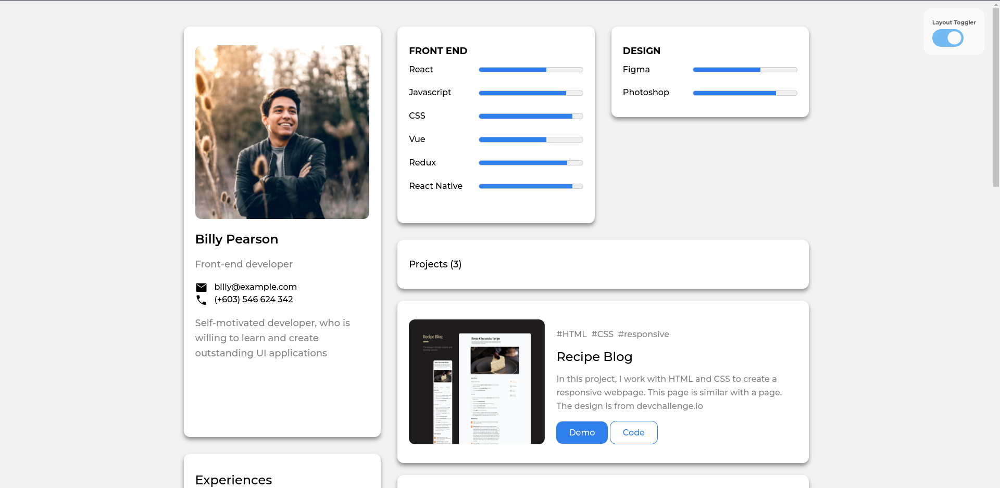

<h1 align="center">Portfolio Project</h1>

   Solution for a challenge from  <a href="http://devchallenges.io" target="_blank">Devchallenges.io</a>.

  <h3>
    <a href="https://moonlit-heliotrope-333c8e.netlify.app/">
      Demo
    </a>
     | 
    <a href="https://github.com/dXu23/portfolio-devchallenges">
      Solution
    </a>
     | 
    <a href="https://devchallenges.io/challenges/5ZnOYsSXM24JWnCsNFlt">
      Challenge
    </a>
  </h3>

<!-- TABLE OF CONTENTS -->

## Table of Contents

- [Overview](#overview)
  - [Built With](#built-with)
- [Features](#features)
- [How to use](#how-to-use)
- [Contact](#contact)
- [Acknowledgements](#acknowledgements)

<!-- OVERVIEW -->

## Overview

Introduce your projects by taking a screenshot or a gif. Try to tell visitors a story about your project by answering:

### Built With

Just plain HTML, CSS, and Javascript.

## Features

This application/site was created as a submission to a [DevChallenges](https://devchallenges.io/challenges) challenge. The [challenge](https://devchallenges.io/challenges/5ZnOYsSXM24JWnCsNFlt) was to build an application to complete the given user stories.

## How To Use

Just open the index.html in the browser.

## Contact

- Website [coldfix.dev](https://coldfix.dev)
- GitHub [dXu23](https://github.com/dXu23)
